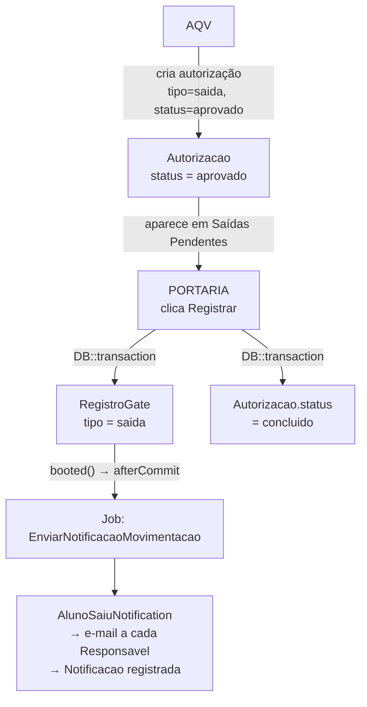
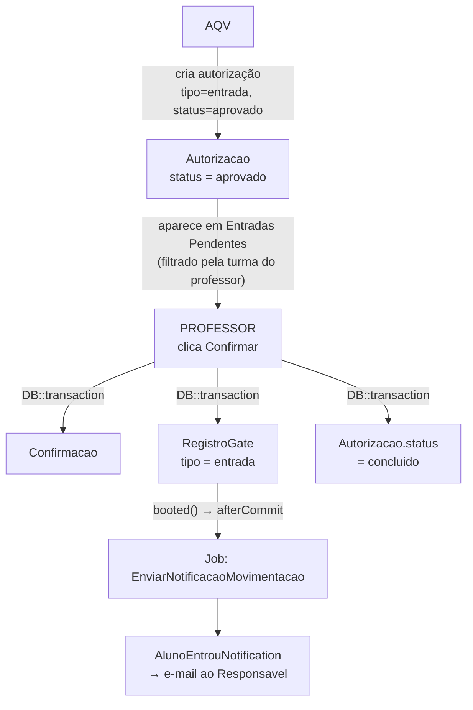
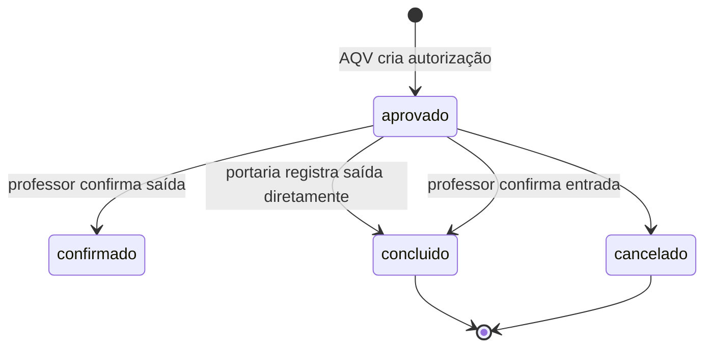
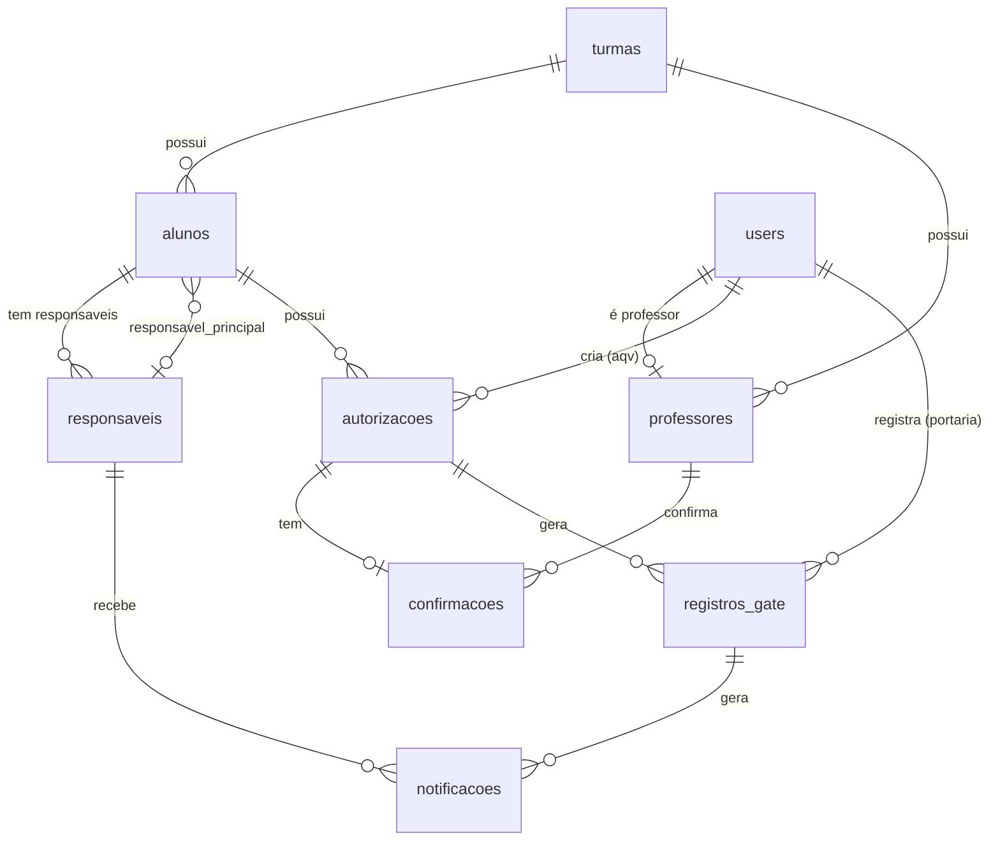

# SAFE — Sistema de Autorização e Fluxo Escolar


> Painel administrativo para controle de saídas e entradas de alunos em instituições de ensino, com notificações automáticas aos responsáveis.

---

## Sobre o projeto

O **SAFE** resolve um problema operacional comum em escolas: o controle manual, descentralizado e sem rastreabilidade das autorizações de saída e entrada de alunos durante o período escolar.

Antes do SAFE, autorizações eram feitas em papel ou por mensagens de WhatsApp, sem histórico, sem notificação padronizada aos responsáveis e sem visibilidade em tempo real para a portaria.

O SAFE digitaliza esse fluxo em etapas rastreáveis:

1. O setor **AQV** (Atendimento e Qualidade de Vida) cria a autorização no sistema
2. O **professor** confirma que o aluno pode sair da sala (ou que o aluno retornou)
3. A **portaria** registra a movimentação física na entrada/saída da escola
4. O **responsável** recebe notificação automática por e-mail

Cada etapa fica registrada com timestamp, usuário responsável e quantidade de aulas impactadas.

### Contexto acadêmico

Projeto desenvolvido como trabalho — SENAI Limeira, 2026.

---

## Tecnologias

| Tecnologia | Versão | Justificativa |
|---|---|---|
| **PHP** | ^8.3 | Suporte a propriedades readonly, fibers e melhorias de performance |
| **Laravel** | ^13.8 | Framework MVC maduro com ecossistema rico e convenções produtivas |
| **Filament** | ^5.6 | Painel admin completo com CRUD, widgets e autenticação prontos |
| **Spatie Laravel Permission** | ^7.4 | Gerenciamento de roles/permissions mais adotado do ecossistema Laravel |
| **irazasyed/telegram-bot-sdk** | ^3.16 | SDK para notificações via Telegram (canal preparado para uso futuro) |
| **SQLite** | (nativo) | Banco zero-config para desenvolvimento; troca para MySQL em produção via `.env` |

**Dependências de desenvolvimento:**

| Pacote | Versão | Uso |
|---|---|---|
| Laravel Pail | ^1.2.5 | Tail de logs no terminal |
| Laravel Pint | ^1.27 | Formatador de código (PSR-12) |
| PHPUnit | ^12.5.12 | Suite de testes |
| Faker | ^1.23 | Geração de dados falsos nos seeders |

---

## Funcionalidades

### Módulo Autorizações (AQV e Admin)
- Criar autorização de saída ou entrada para qualquer aluno
- Informar número de aulas impactadas e observação livre
- Badge na navegação com contagem de autorizações aprovadas ainda não processadas
- Visualizar histórico completo com filtros por status e tipo

### Módulo Liberações Pendentes (Professor)
- Ver saídas aprovadas aguardando confirmação do professor (filtradas pela turma do professor logado)
- Confirmar saída com um clique (modal de confirmação + registro de Confirmacao)
- Badge com contagem de alunos aguardando liberação da sala

### Módulo Entradas Pendentes (Professor)
- Ver autorizações de entrada aprovadas aguardando confirmação
- Confirmar entrada criando `Confirmacao` + `RegistroGate` em uma única transação
- Disparo automático de notificação ao responsável após confirmação

### Módulo Saídas Pendentes / Portaria
- Fila de autorizações de saída aprovadas aguardando registro físico
- Badge vermelho com contagem de saídas pendentes
- Registrar saída com confirmação modal (exibe turma e aulas perdidas)
- Após registro, notificação é disparada automaticamente ao responsável

### Módulo Notificações (Admin)
- Histórico de todas as notificações enviadas ou com falha
- Colunas: aluno, responsável, e-mail de destino, canal, status (badge colorido), horário de envio

### Dashboard
- **ResumoHojeWidget** (admin/portaria/aqv): autorizações do dia, saídas registradas, notificações enviadas, aulas perdidas acumuladas
- **ResumoHojeProfessorWidget** (professor): estatísticas filtradas pela turma do professor logado
- **AutorizacoesPendentesWidget**: tabela das 5 autorizações aprovadas mais antigas ainda sem processamento
- **UltimasMovimentacoesWidget**: 10 últimas movimentações do dia com polling automático a cada 60 segundos

### Módulo Escola (Admin)
- **Turmas**: CRUD completo com relation managers para alunos e movimentações
- **Professores**: CRUD com vínculo ao usuário de sistema e à turma
- **Alunos**: CRUD com responsável principal destacado
- **Responsáveis**: CRUD com e-mail e Telegram Chat ID para notificações

---

## Fluxo do sistema

### Fluxo de Saída



### Fluxo de Entrada



### Estados da Autorização



---

## Roles e permissões

| Recurso / Ação | admin | aqv | professor | portaria |
|---|:---:|:---:|:---:|:---:|
| Dashboard (ResumoHoje) | ✓ | ✓ | — | ✓ |
| Dashboard (ResumoProfessor) | — | — | ✓ | — |
| Autorizações (CRUD) | ✓ | ✓ | — | — |
| Liberações Pendentes (ver + confirmar saída) | ✓ | — | ✓ | — |
| Entradas Pendentes (ver + confirmar entrada) | ✓ | — | ✓ | — |
| Saídas Pendentes — Portaria (ver + registrar) | ✓ | — | — | ✓ |
| Notificações (somente leitura) | ✓ | — | — | — |
| Turmas (CRUD) | ✓ | — | — | — |
| Professores (CRUD) | ✓ | — | — | — |
| Alunos (CRUD) | ✓ | — | — | — |
| Responsáveis (CRUD) | ✓ | — | — | — |

> **Nota:** Professores veem apenas alunos da turma vinculada ao seu perfil (`professor.turma_id`).

---

## Instalação e configuração

### Pré-requisitos

- PHP 8.3+
- Composer 2.x
- Node.js 20+ e npm
- SQLite (pré-instalado na maioria dos sistemas) ou MySQL 8+
- [Mailpit](https://mailpit.axllent.org/) para capturar e-mails em desenvolvimento

### Passo a passo

**1. Clone o repositório**

```bash
git clone https://github.com/seu-usuario/senai-SAFE.git
cd senai-SAFE
```

**2. Instale as dependências**

```bash
composer install
npm install
```

**3. Configure o ambiente**

```bash
cp .env.example .env
php artisan key:generate
```

Edite o `.env` conforme a seção [Variáveis de ambiente](#variáveis-de-ambiente).

**4. Crie o arquivo do banco SQLite**

```bash
touch database/database.sqlite
```

> Para MySQL, configure `DB_CONNECTION=mysql` e as variáveis `DB_HOST`, `DB_DATABASE`, `DB_USERNAME`, `DB_PASSWORD`.

**5. Execute as migrações e popule o banco**

```bash
php artisan migrate:fresh --seed
```

Cria todas as tabelas e gera: 6 turmas, 60 alunos, 120 responsáveis, 6 professores automáticos e as 4 contas fixas listadas abaixo.

**6. Compile os assets**

```bash
npm run build
```

**7. Inicie o servidor**

```bash
php artisan serve
```

Acesse: `http://localhost:8000`  
Painel admin: `http://localhost:8000/admin`

---

### Modo desenvolvimento completo

Para rodar todos os processos em paralelo (servidor, queue, logs, Vite):

```bash
composer dev
```

Inicializa simultaneamente:
- `php artisan serve` — servidor HTTP
- `php artisan queue:listen` — worker para as notificações
- `php artisan pail` — tail de logs colorido
- `npm run dev` — Vite com HMR

---

### Contas de teste

Disponíveis após `migrate:fresh --seed`:

| Papel | E-mail | Senha |
|---|---|---|
| **Admin** | `admin@safe.dev` | `password` |
| **AQV** | `aqv@safe.dev` | `password` |
| **Professor** | `professor@safe.dev` | `password` |
| **Portaria** | `portaria@safe.dev` | `password` |

---

### Configuração do Mailpit

**Instalar:**
```bash
# Via script (Linux/macOS)
curl -sL https://raw.githubusercontent.com/axllent/mailpit/develop/install.sh | bash

# Via Docker
docker run -d -p 8025:8025 -p 1025:1025 axllent/mailpit
```

**Configurar no `.env`:**
```env
MAIL_MAILER=smtp
MAIL_HOST=127.0.0.1
MAIL_PORT=1025
MAIL_FROM_ADDRESS="safe@escola.dev"
MAIL_FROM_NAME="SAFE Sistema Escolar"
```

Interface web: `http://localhost:8025`

---

## Estrutura do projeto

```
senai-SAFE/
├── app/
│   ├── Filament/
│   │   ├── Resources/
│   │   │   ├── Alunos/              # CRUD de alunos (admin)
│   │   │   ├── Autorizacaos/        # CRUD de autorizações (AQV/admin)
│   │   │   ├── Confirmacaos/        # Liberação de saída pelo professor
│   │   │   ├── EntradasPendentes/   # Entradas aguardando confirmação
│   │   │   ├── Notificacaos/        # Histórico de notificações (admin)
│   │   │   ├── Professors/          # CRUD de professores (admin)
│   │   │   ├── RegistroGates/       # Saídas pendentes na portaria
│   │   │   ├── Responsavels/        # CRUD de responsáveis (admin)
│   │   │   └── Turmas/              # CRUD de turmas + relation managers
│   │   └── Widgets/                 # Widgets do dashboard
│   ├── Http/Responses/
│   │   └── LogoutResponse.php       # Redireciona para '/' após logout
│   ├── Jobs/
│   │   └── EnviarNotificacaoMovimentacao.php
│   ├── Models/                      # Eloquent models
│   ├── Notifications/
│   │   ├── AlunoEntrouNotification.php
│   │   └── AlunoSaiuNotification.php
│   └── Providers/
│       ├── AppServiceProvider.php
│       └── Filament/AdminPanelProvider.php
├── database/
│   ├── factories/
│   ├── migrations/
│   └── seeders/
├── resources/views/
│   └── landing.blade.php
└── routes/web.php
```

Cada Resource Filament segue a estrutura interna:
```
ResourceName/
├── ResourceNameResource.php   # Definição principal, canViewAny, getEloquentQuery
├── Pages/                     # List, Create, Edit, View
├── Schemas/                   # Form e Infolist separados
└── Tables/                    # Definição da tabela separada
```

---

## Banco de dados

### Diagrama ERD



### Tabelas e campos principais

**`turmas`**
| Campo | Tipo | Descrição |
|---|---|---|
| `id` | bigint PK | |
| `nome` | string | Ex: "DS-2026-A" |
| `periodo` | enum | `manha`, `tarde`, `noite` |
| `ano_letivo` | string(9) | Ex: "2026/2027" |

**`alunos`**
| Campo | Tipo | Descrição |
|---|---|---|
| `id` | bigint PK | |
| `turma_id` | FK | Cascata na deleção |
| `responsavel_principal_id` | FK nullable | Nullable (nullOnDelete) |
| `nome` | string | |
| `matricula` | string unique | |
| `foto_url` | string nullable | |

**`responsaveis`**
| Campo | Tipo | Descrição |
|---|---|---|
| `id` | bigint PK | |
| `aluno_id` | FK | Cascata na deleção |
| `nome` | string | |
| `email` | string | Destino das notificações |
| `telefone` | string(20) nullable | |
| `telegram_chat_id` | string nullable | Para canal Telegram futuro |
| `parentesco` | enum | `pai`, `mae`, `avo`, `ava`, `tio`, `tia`, `responsavel_legal`, `outro` |

**`professores`**
| Campo | Tipo | Descrição |
|---|---|---|
| `id` | bigint PK | |
| `user_id` | FK | Login no sistema |
| `turma_id` | FK | Turma que o professor leciona |
| `nome` | string | |
| `matricula` | string unique | |

**`autorizacoes`**
| Campo | Tipo | Descrição |
|---|---|---|
| `id` | bigint PK | |
| `aluno_id` | FK | |
| `aqv_user_id` | FK | Usuário que criou |
| `tipo` | enum | `entrada`, `saida` |
| `status` | enum | `aprovado`, `confirmado`, `concluido`, `cancelado` |
| `aulas_perdidas` | tinyint | Default 0 |
| `observacao` | text nullable | |

**`confirmacoes`**
| Campo | Tipo | Descrição |
|---|---|---|
| `id` | bigint PK | |
| `autorizacao_id` | FK | 1:1 com autorizacao |
| `professor_id` | FK | |
| `confirmado_at` | datetime | |
| `observacao` | text nullable | |

**`registros_gate`**
| Campo | Tipo | Descrição |
|---|---|---|
| `id` | bigint PK | |
| `autorizacao_id` | FK | 1:1 com autorizacao |
| `user_id` | FK | Portaria que registrou |
| `tipo` | enum | `entrada`, `saida` |
| `registrado_at` | datetime | |
| `aulas_perdidas` | tinyint | Copiado da autorizacao |
| `observacao` | text nullable | |

**`notificacoes`**
| Campo | Tipo | Descrição |
|---|---|---|
| `id` | bigint PK | |
| `registro_id` | FK | `registros_gate.id` |
| `responsavel_id` | FK nullable | |
| `canal` | enum | `mail`, `telegram` |
| `status` | enum | `pendente`, `enviado`, `falhou` |
| `enviado_at` | datetime nullable | |

---

## API e rotas

O SAFE não expõe API REST pública. As rotas disponíveis são:

| Método | URI | Descrição |
|---|---|---|
| `GET` | `/` | Página inicial pública (landing) |
| `GET` | `/admin` | Painel (redireciona para login) |
| `GET` | `/admin/login` | Login do painel |
| `*` | `/admin/autorizacoes` | CRUD de autorizações |
| `GET` | `/admin/liberacoes` | Liberações pendentes (professor) |
| `GET` | `/admin/entradas-pendentes` | Entradas pendentes (professor) |
| `GET` | `/admin/registros-gate` | Saídas pendentes (portaria) |
| `GET` | `/admin/notificacoes` | Histórico de notificações (admin) |
| `*` | `/admin/turmas` | CRUD de turmas |
| `*` | `/admin/professores` | CRUD de professores |
| `*` | `/admin/alunos` | CRUD de alunos |
| `*` | `/admin/responsaveis` | CRUD de responsáveis |

---

## Variáveis de ambiente

| Variável | Padrão | Descrição |
|---|---|---|
| `APP_NAME` | `Laravel` | Nome exibido em e-mails e no painel |
| `APP_ENV` | `local` | `local` em dev, `production` em produção |
| `APP_KEY` | — | Gerada via `php artisan key:generate` |
| `APP_DEBUG` | `true` | Desativar (`false`) em produção |
| `APP_URL` | `http://localhost` | URL base completa |
| `DB_CONNECTION` | `sqlite` | `sqlite`, `mysql`, `pgsql` |
| `DB_HOST` | `127.0.0.1` | Host do banco (MySQL/PostgreSQL) |
| `DB_PORT` | `3306` | Porta do banco |
| `DB_DATABASE` | — | Nome do banco ou caminho SQLite |
| `DB_USERNAME` | — | Usuário do banco |
| `DB_PASSWORD` | — | Senha do banco |
| `SESSION_DRIVER` | `database` | Driver de sessão |
| `QUEUE_CONNECTION` | `database` | `database`, `redis` ou `sync` (dev) |
| `MAIL_MAILER` | `log` | `log` (dev), `smtp` (prod), `mailpit` |
| `MAIL_HOST` | `127.0.0.1` | Host SMTP |
| `MAIL_PORT` | `2525` | Porta SMTP (Mailpit usa 1025) |
| `MAIL_FROM_ADDRESS` | `hello@example.com` | Remetente dos e-mails |
| `MAIL_FROM_NAME` | `${APP_NAME}` | Nome do remetente |
| `TELEGRAM_BOT_TOKEN` | — | Token do bot Telegram (canal futuro) |

---

## Contribuição

```bash
# Todos os serviços em paralelo
composer dev

# Formatar código (PSR-12)
./vendor/bin/pint

# Rodar testes
php artisan test

# Recriar banco com dados frescos
php artisan migrate:fresh --seed
```

**Padrões adotados:**
- PSR-12 via Laravel Pint
- Schemas de form e infolist separados em `Schemas/`, tabelas em `Tables/`
- Lógica de query nos Resources (`getEloquentQuery`) e scopes reutilizáveis nos Models
- `DB::transaction()` em toda ação que toca múltiplas tabelas
- Jobs com `afterCommit()` para garantir consistência antes do disparo de eventos

---

## Licença

Projeto acadêmico desenvolvido para o SENAI Limeira. Licença [MIT](https://opensource.org/licenses/MIT).
