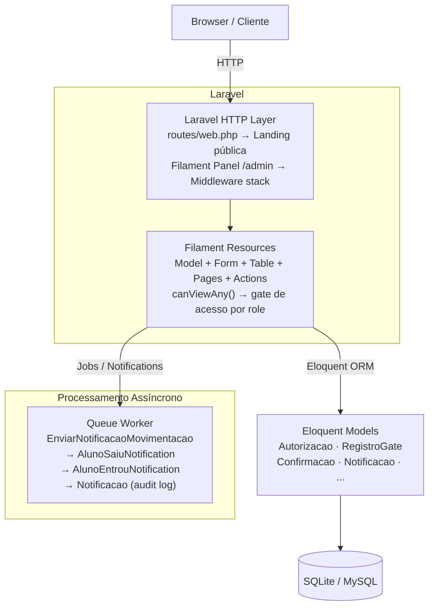
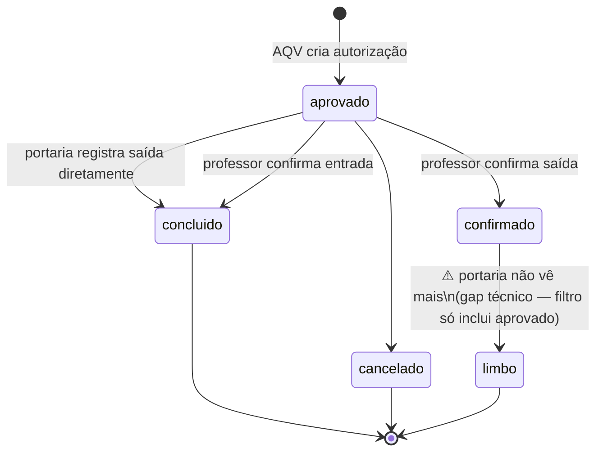
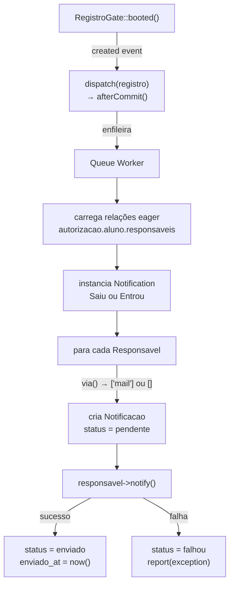

# SAFE — Documentação Técnica

> Referência técnica completa para desenvolvedores. Cobre arquitetura, models, fluxo de autorização, sistema de notificações, resources Filament, segurança, performance e guia de desenvolvimento.

---

## Arquitetura

### Visão geral em camadas



### Por que Filament?

O Filament foi escolhido porque entrega em uma única dependência: autenticação, autorização, CRUD completo, widgets de dashboard, formulários reativos, tabelas com filtros/busca/export e notificações in-app. Isso eliminou a necessidade de scaffolding manual de controllers, views e rotas — o que em um projeto acadêmico com prazo curto é decisivo.

A alternativa seria escrever todos esses controllers e views à mão (padrão MVC Laravel puro), o que adicionaria semanas de trabalho sem agregar valor ao domínio do problema.

### Por que Spatie Permission?

O controle de acesso do sistema precisa de quatro perfis bem definidos (admin, aqv, professor, portaria) com permissões distintas por recurso. O Spatie Permission oferece:

- `HasRoles` trait nos Users
- `hasRole()` / `hasAnyRole()` para checagens inline
- Integração automática com o cache de permissões do Laravel
- Nenhum overhead de configuração comparado a implementar roles manualmente

A alternativa de usar Policies Laravel formais foi descartada por adicionar mais arquivos sem aumentar a expressividade para o caso de uso (ver [Dívida técnica](#dívida-técnica-conhecida)).

---

## Models e banco de dados

### `User` — `app/Models/User.php`

**Tabela:** `users`

**Traits:** `Notifiable`, `HasRoles` (Spatie), `HasFactory`

**Campos:** `name`, `email`, `password`, `remember_token`

**Relacionamentos:**
```php
hasOne(Professor::class)       // perfil de professor vinculado
hasMany(RegistroGate::class)   // registros feitos como portaria
```

**Papel no sistema:** É o modelo de autenticação. A role atribuída via Spatie determina quais resources o usuário consegue ver e quais ações pode executar. Um usuário com role `professor` deve ter também um registro em `professores` para que o filtro de turma funcione corretamente.

---

### `Turma` — `app/Models/Turma.php`

**Tabela:** `turmas`

**Campos:** `nome`, `periodo` (enum: manha/tarde/noite), `ano_letivo`

**Relacionamentos:**
```php
hasMany(Aluno::class)
hasMany(Professor::class)
```

---

### `Aluno` — `app/Models/Aluno.php`

**Tabela:** `alunos`

**Campos:** `turma_id`, `responsavel_principal_id` (nullable FK), `nome`, `matricula` (unique), `foto_url` (nullable)

**Relacionamentos:**
```php
belongsTo(Turma::class)
belongsTo(Responsavel::class, 'responsavel_principal_id')   // responsavel principal
hasMany(Responsavel::class)                                  // todos os responsaveis
hasMany(Autorizacao::class)
```

**Nota de design:** O campo `responsavel_principal_id` é uma FK `nullOnDelete` para `responsaveis`. Ele é separado de `aluno_id` em `responsaveis` para permitir que um aluno tenha N responsáveis, mas apenas um marcado como principal para exibição rápida.

---

### `Responsavel` — `app/Models/Responsavel.php`

**Tabela:** `responsaveis`

**Traits:** `Notifiable` (para receber notificações Laravel)

**Campos:** `aluno_id`, `nome`, `email`, `telefone`, `telegram_chat_id`, `parentesco`

**Enum `parentesco`:** `pai`, `mae`, `avo`, `ava`, `tio`, `tia`, `responsavel_legal`, `outro`

**Método importante:**
```php
public function routeNotificationForMail(): string
{
    return $this->email;
}
```

Sobrescreve o comportamento padrão do Laravel que usaria `email` do model `User`. Como `Responsavel` não é um `User`, é necessário informar explicitamente qual campo usar como destino do e-mail.

---

### `Professor` — `app/Models/Professor.php`

**Tabela:** `professores`

**Campos:** `user_id`, `turma_id`, `nome`, `matricula` (unique)

**Relacionamentos:**
```php
belongsTo(User::class)
belongsTo(Turma::class)
hasMany(Confirmacao::class)
```

**Papel no filtro de turma:** Quando um usuário com role `professor` loga, o sistema acessa `auth()->user()->professor->turma_id` para filtrar autorizações visíveis apenas para alunos da turma dele. Se o usuário tem role `professor` mas não tem registro em `professores`, o filtro não é aplicado e ele vê todos os alunos.

---

### `Autorizacao` — `app/Models/Autorizacao.php`

**Tabela:** `autorizacoes`

**Campos:**
```
aluno_id        FK → alunos
aqv_user_id     FK → users (quem criou)
tipo            enum: entrada | saida
status          enum: aprovado | confirmado | concluido | cancelado
aulas_perdidas  tinyint, default 0
observacao      text nullable
```

**Accessor:**
```php
public function getValidadeAttribute(): Carbon
{
    return today()->endOfDay();
}
```
Autorizações valem apenas no dia de criação (retorna `today()->endOfDay()`). Não há campo `validade` no banco — o valor é computado dinamicamente.

**Scopes:**

| Scope | Implementação | Uso |
|---|---|---|
| `aprovadas()` | `where('status', 'aprovado')` | Filtrar autorizações ativas |
| `pendentesGate()` | `whereDoesntHave('registrosGate')` | Saídas sem registro na portaria |
| `pendentesConfirmacao()` | `whereDoesntHave('confirmacao')` | Sem confirmação do professor |
| `saidas()` | `where('tipo', 'saida')` | Filtrar por tipo |
| `entradas()` | `where('tipo', 'entrada')` | Filtrar por tipo |

**Método `estaValida()`:**
```php
public function estaValida(): bool
{
    return $this->status === 'aprovado';
}
```

Os scopes são a peça central da lógica de negócio: os badges de navegação, os widgets do dashboard e os `getEloquentQuery()` dos Resources todos os compõem para construir suas queries.

---

### `Confirmacao` — `app/Models/Confirmacao.php`

**Tabela:** `confirmacoes`

**Campos:** `autorizacao_id`, `professor_id`, `confirmado_at` (datetime), `observacao`

Representa o aceite do professor de que o aluno pode sair da sala (saída) ou que o aluno voltou (entrada). Há no máximo 1 confirmação por autorização.

---

### `RegistroGate` — `app/Models/RegistroGate.php`

**Tabela:** `registros_gate`

**Campos:** `autorizacao_id`, `user_id`, `tipo`, `registrado_at`, `observacao`, `aulas_perdidas`

**O hook `booted()`:**
```php
protected static function booted(): void
{
    static::created(function (RegistroGate $registro) {
        EnviarNotificacaoMovimentacao::dispatch($registro)->afterCommit();
    });
}
```

Este é o ponto de entrada do sistema de notificações. O evento `created` é emitido toda vez que um novo `RegistroGate` é persistido — seja pela portaria em saídas, seja pelo professor em entradas. O `->afterCommit()` é crítico: garante que o job só entra na fila depois que a transação do banco commitar, evitando que o job leia um estado inconsistente.

---

### `Notificacao` — `app/Models/Notificacao.php`

**Tabela:** `notificacoes`

**Campos:** `registro_id`, `responsavel_id` (nullable FK), `canal`, `status`, `enviado_at`

**Enums:**
- `canal`: `mail`, `telegram`
- `status`: `pendente`, `enviado`, `falhou`

Funciona como audit log: para cada responsável notificado em cada canal, um registro é criado com status `pendente`, depois atualizado para `enviado` ou `falhou`.

---

### Índices de performance

Criados em `2026_05_22_000001_add_performance_indexes.php`:

| Índice | Tabela | Colunas | Justificativa |
|---|---|---|---|
| `autorizacoes_status_created_at_index` | `autorizacoes` | `(status, created_at)` | Queries dos badges e widgets filtram por status + data |
| `confirmacoes_autorizacao_id_index` | `confirmacoes` | `(autorizacao_id)` | `whereDoesntHave('confirmacao')` usa subquery nessa coluna |
| `registros_gate_autorizacao_id_index` | `registros_gate` | `(autorizacao_id)` | `whereDoesntHave('registrosGate')` idem |

As FKs criam índices automaticamente na maioria dos bancos, mas SQLite não garante isso — os índices explícitos asseguram performance mesmo em SQLite.

---

## Fluxo de autorização detalhado

### Fluxo de Saída — passo a passo técnico

**Passo 1 — AQV cria a autorização**

```
POST /admin/autorizacoes/create
→ Autorizacao::create([
    'aluno_id'      => $alunoId,
    'aqv_user_id'   => auth()->id(),
    'tipo'          => 'saida',
    'status'        => 'aprovado',   // default no banco
    'aulas_perdidas'=> $aulasPerdidas,
    'observacao'    => $observacao,
  ])
```

Models tocados: `Autorizacao` (insert)

**Passo 2 — Portaria vê a saída pendente**

```
GET /admin/registros-gate
→ RegistroGateResource::getEloquentQuery()
  = Autorizacao::saidas()->aprovadas()->pendentesGate()
    ->with(['aluno.turma'])
```

A query retorna autorizações onde:
- `tipo = 'saida'`
- `status = 'aprovado'`
- `NOT EXISTS (SELECT 1 FROM registros_gate WHERE autorizacao_id = autorizacoes.id)`

**Passo 3 — Portaria registra a saída**

```
Action::make('registrar')->action(function (Autorizacao $record): void {
    DB::transaction(function () use ($record, $agora): void {
        RegistroGate::create([...]);      // dispara booted() → Job
        $record->update(['status' => 'concluido']);
    });
})
```

Models tocados: `RegistroGate` (insert), `Autorizacao` (update status → `concluido`)

O `RegistroGate::create()` dentro da transação dispara o evento `created`, mas o job só é enfileirado após o `COMMIT` da transação (`afterCommit()`).

**Passo 4 — Job processa a notificação**

```
EnviarNotificacaoMovimentacao::handle():
  $registro->load(['autorizacao.aluno.responsaveis', 'user'])
  $notification = new AlunoSaiuNotification($aluno, $registro)
  
  foreach ($responsaveis as $responsavel):
    $canais = $notification->via($responsavel)  // ['mail'] se tem email
    
    foreach $canais:
      $notificacao = $registro->notificacoes()->create([
        'responsavel_id' => $responsavel->id,
        'canal'          => $canal,
        'status'         => 'pendente',
      ])
    
    try:
      $responsavel->notify($notification)
      $notificacao->update(['status' => 'enviado', 'enviado_at' => now()])
    catch Throwable:
      $notificacao->update(['status' => 'falhou'])
      report($exception)
```

Models tocados: `Notificacao` (insert × N canais), `Notificacao` (update status)

### Fluxo de Entrada — diferenças

Para entradas, o professor é quem cria o `RegistroGate` diretamente (sem passo intermediário de portaria):

```
EntradasPendentesTable Action::make('confirmar_entrada')->action(function (Autorizacao $record): void {
    DB::transaction(function () use ($record, $professor, $agora): void {
        Confirmacao::create([...]);      // confirmação do professor
        RegistroGate::create([          // já cria o registro de portaria
            'tipo' => 'entrada',
            'registrado_at' => $agora,
        ]);
        $record->update(['status' => 'concluido']);
    });
})
```

O `RegistroGate::create()` aqui também dispara `booted()` → job → `AlunoEntrouNotification`.

### Transição de status da Autorizacao



> **Gap técnico identificado:** Quando o professor confirma uma saída (`status → confirmado`), a autorizacao sai do filtro do `RegistroGateResource` (que filtra por `status = 'aprovado'`). O Resource de Saídas Pendentes deveria filtrar por `status IN ('aprovado', 'confirmado')`. Isso é dívida técnica conhecida.

---

## Sistema de notificações

### Arquitetura do sistema



### `EnviarNotificacaoMovimentacao` Job

```php
class EnviarNotificacaoMovimentacao implements ShouldQueue
{
    use Dispatchable, InteractsWithQueue, Queueable, SerializesModels;

    public function __construct(public RegistroGate $registro) {}
}
```

O model `RegistroGate` é serializado com `SerializesModels`, o que significa que apenas o ID é armazenado na fila — o job recarrega o model do banco quando executa. Por isso o `load()` explícito no `handle()`.

### Notifications

**`AlunoSaiuNotification`** — enviada quando portaria registra saída:
- Subject: `SAFE — Saída registrada`
- Corpo: nome do aluno, horário, aulas perdidas, nome do operador da portaria

**`AlunoEntrouNotification`** — enviada quando professor confirma entrada:
- Subject: `SAFE — Entrada registrada`
- Corpo: nome do aluno, horário, aulas perdidas (da autorização), nome do portaria/professor

**Método `via()`:**
```php
public function via($notifiable): array
{
    return filled($notifiable->email) ? ['mail'] : [];
}
```

A seleção de canal é condicional: se o responsável tem e-mail, usa `['mail']`; caso contrário, retorna `[]` e o responsável não recebe nada neste canal. A lógica para Telegram seria adicionada aqui.

### Como funciona em desenvolvimento (Mailpit)

Com `MAIL_MAILER=smtp` e `MAIL_HOST=127.0.0.1`, `MAIL_PORT=1025`, o Laravel envia os e-mails para o Mailpit, que os intercepta e exibe em `http://localhost:8025` sem enviá-los de verdade. Com `MAIL_MAILER=log`, os e-mails são apenas escritos no log (sem servidor SMTP necessário).

### Como adicionar o canal Telegram

1. Garantir que `TELEGRAM_BOT_TOKEN` está no `.env`
2. No método `via()` das notifications, adicionar:

```php
public function via($notifiable): array
{
    $canais = [];
    if (filled($notifiable->email))              $canais[] = 'mail';
    if (filled($notifiable->telegram_chat_id))   $canais[] = 'telegram';
    return $canais;
}
```

3. Adicionar método `toTelegram()` nas notifications:

```php
public function toTelegram($notifiable): TelegramMessage
{
    return TelegramMessage::create()
        ->to($notifiable->telegram_chat_id)
        ->content("O aluno {$this->aluno->nome} saiu da escola às ...");
}
```

4. Registrar o canal em `config/services.php` conforme docs do `irazasyed/telegram-bot-sdk`.

---

## Filament Resources

### Padrão de estrutura

Todos os Resources seguem a mesma organização interna:

```
ResourceNameResource.php     ← definição central (modelo, nav, canViewAny, getEloquentQuery)
Pages/
  ├─ ListResourceName.php
  ├─ CreateResourceName.php
  ├─ EditResourceName.php
  └─ ViewResourceName.php
Schemas/
  ├─ ResourceNameForm.php     ← campos do formulário de criação/edição
  └─ ResourceNameInfolist.php ← campos da tela de visualização
Tables/
  └─ ResourceNamesTable.php   ← colunas, filtros, actions de linha
```

Esta separação — schemas e tabelas em arquivos próprios — é uma escolha deliberada para evitar resources com 500+ linhas. É um padrão recomendado pelo próprio Filament para projetos maiores.

### `AutorizacaoResource`

- **Model:** `Autorizacao`
- **Slug:** `/admin/autorizacoes`
- **Grupo de nav:** Autorizações (sort 1)
- **canViewAny:** roles `aqv`, `admin`
- **getEloquentQuery:** eager load `['aluno.turma', 'aqv']`
- **Badge:** conta `aprovadas().pendentesConfirmacao().pendentesGate()` do dia atual — autorizações aprovadas hoje sem confirmação nem registro de portaria

```php
public static function getNavigationBadge(): ?string
{
    $count = Autorizacao::aprovadas()
        ->pendentesConfirmacao()
        ->pendentesGate()
        ->whereDate('created_at', today())
        ->count();

    return $count > 0 ? (string) $count : null;
}
```

### `RegistroGateResource`

- **Model:** `Autorizacao` (não `RegistroGate`!) — lista autorizações que ainda precisam de registro
- **Slug:** `/admin/registros-gate`
- **Label:** "Saídas Pendentes"
- **Grupo de nav:** Movimentações (sort 2)
- **canViewAny:** roles `portaria`, `admin`
- **canCreate:** `false` — não é possível criar diretamente
- **getEloquentQuery:** `Autorizacao::saidas().aprovadas().pendentesGate().with(['aluno.turma'])`
- **Action `registrar`:** cria `RegistroGate` + atualiza `status → concluido` em transação

**Por que o model base é `Autorizacao` e não `RegistroGate`?**

A tela de portaria precisa mostrar autorizações aguardando processamento, não registros que já foram feitos. O Resource age como uma "fila de trabalho" baseada em Autorizacoes filtradas.

### `ConfirmacaoResource`

- **Model:** `Autorizacao`
- **Slug:** `/admin/liberacoes`
- **`$shouldRegisterNavigation = false`** — não aparece no menu lateral
- **canViewAny:** roles `professor`, `admin`
- **getEloquentQuery:** saídas aprovadas sem confirmação, filtradas pela turma do professor logado
- **Action `liberar_saida`:** cria `Confirmacao` + atualiza `status → confirmado` em transação

> Este Resource não está no menu de navegação. A tela existe em `/admin/liberacoes` mas não é acessada diretamente por link na sidebar. Isso é dívida técnica — o Resource foi deslocado para `EntradasPendentes` que trata entradas, mas a confirmação de saída pelo professor ainda precisa de um ponto de acesso claro na navegação.

### `EntradasPendentesResource`

- **Model:** `Autorizacao`
- **Slug:** `/admin/entradas-pendentes`
- **Grupo de nav:** Movimentações (sort 1)
- **canViewAny:** roles `professor`, `admin`
- **getEloquentQuery:** entradas aprovadas sem confirmação, filtradas pela turma
- **Action `confirmar_entrada`:** cria `Confirmacao` + `RegistroGate` + `status → concluido` em uma única transação

### `NotificacaoResource`

- **Model:** `Notificacao`
- **Slug:** `/admin/notificacoes`
- **Grupo de nav:** Portaria (sort 3)
- **canViewAny:** apenas `admin`
- **canCreate:** `false`
- **getEloquentQuery:** eager load `['registroGate.autorizacao.aluno', 'responsavel']`

### Resources de gestão (somente admin)

| Resource | Model | Slug | Destaques |
|---|---|---|---|
| `TurmaResource` | `Turma` | `/admin/turmas` | RelationManagers: Alunos, Movimentações |
| `ProfessorResource` | `Professor` | `/admin/professores` | eager load `['turma', 'user']` |
| `AlunoResource` | `Aluno` | `/admin/alunos` | eager load `['turma', 'responsavelPrincipal']` |
| `ResponsavelResource` | `Responsavel` | `/admin/responsaveis` | eager load `['aluno']` |

### Filtro de turma para professores

Dois Resources aplicam filtro automático por turma quando o usuário logado é professor:

```php
// ConfirmacaoResource::getEloquentQuery()
$user = auth()->user();
if ($user && $user->professor) {
    $query->whereHas('aluno',
        fn (Builder $q) => $q->where('turma_id', $user->professor->turma_id)
    );
}
```

O mesmo padrão existe em `EntradasPendentesResource` e nos badges de navegação de ambos. Sem esse filtro, um professor veria autorizações de alunos de outras turmas.

---

## Segurança

### Controle de acesso por Resource

O Filament verifica `canViewAny()` antes de renderizar qualquer rota do Resource. Se retornar `false`, o Resource inteiro fica inacessível (404 ou redirect para o dashboard).

| Resource | Guard |
|---|---|
| `AutorizacaoResource` | `hasAnyRole(['aqv', 'admin'])` |
| `RegistroGateResource` | `hasAnyRole(['portaria', 'admin'])` |
| `ConfirmacaoResource` | `hasAnyRole(['professor', 'admin'])` |
| `EntradasPendentesResource` | `hasAnyRole(['professor', 'admin'])` |
| `NotificacaoResource` | `hasRole('admin')` |
| `TurmaResource` | `hasAnyRole(['admin'])` |
| `ProfessorResource` | `hasRole('admin')` |
| `AlunoResource` | `hasRole('admin')` |
| `ResponsavelResource` | `hasRole('admin')` |

### Operações de escrita protegidas

- `canCreate()` retorna `false` em Resources que são filas de trabalho (`RegistroGateResource`, `ConfirmacaoResource`, `EntradasPendentesResource`, `NotificacaoResource`)
- `TurmaResource` protege individualmente `canCreate()`, `canEdit()` e `canDelete()` com verificação de role `admin`

### Autenticação

O painel usa o middleware stack padrão do Filament:
- `EncryptCookies`
- `AuthenticateSession`
- `PreventRequestForgery` (CSRF)
- `Authenticate` (exige login)

O logout é customizado via `AppServiceProvider`:
```php
$this->app->bind(LogoutResponseContract::class, LogoutResponse::class);
```
Redireciona para `/` (landing page) em vez do padrão `/admin/login`.

### O que ainda pode ser melhorado

1. **Policies formais:** Atualmente o controle de acesso usa `hasRole()` inline em cada Resource. Policies Laravel (`AlunoPolicy`, `AutorizacaoPolicy`, etc.) separariam essa lógica e permitiriam testes unitários por operação.

2. **Validação de integridade no fluxo:** Não há verificação server-side impedindo que a portaria registre uma saída já registrada via race condition. O `whereDoesntHave` na query previne exibição, mas não há lock otimista ou unique constraint no banco para `(autorizacao_id)` em `registros_gate`.

3. **Autorização de saída sem confirmação do professor:** O `RegistroGateResource` permite que a portaria registre uma saída sem confirmação prévia do professor. Pode ser intencional (cenário de emergência), mas não há distinção clara.

---

## Performance

### Eager loading

Todos os Resources carregam relações via `getEloquentQuery()` para evitar N+1:

```php
// AutorizacaoResource
->with(['aluno.turma', 'aqv'])

// RegistroGateResource
->with(['aluno.turma'])

// NotificacaoResource
->with(['registroGate.autorizacao.aluno', 'responsavel'])

// AlunoResource
->with(['turma', 'responsavelPrincipal'])
```

O `EnviarNotificacaoMovimentacao::handle()` também carrega relações explicitamente:
```php
$registro->load(['autorizacao.aluno.responsaveis', 'user']);
```

### Índices compostos

O índice `(status, created_at)` em `autorizacoes` beneficia as queries mais frequentes do sistema:

```sql
-- Badge do AutorizacaoResource
SELECT COUNT(*) FROM autorizacoes
WHERE status = 'aprovado'
  AND DATE(created_at) = DATE('now')
  -- + subqueries de confirmacao e registros_gate
```

O banco usa o índice para filtrar por `status` primeiro (cardinalidade baixa), depois por `created_at`.

### Scopes reutilizáveis

Os scopes em `Autorizacao` centralizam a lógica de filtro e são usados consistentemente em Resources, Widgets e badges:

```php
// Evita repetição de strings mágicas em queries
Autorizacao::saidas()->aprovadas()->pendentesGate()->count()

// Equivalente verboso sem scopes:
Autorizacao::where('tipo', 'saida')
    ->where('status', 'aprovado')
    ->whereDoesntHave('registrosGate')
    ->count()
```

### Polling no widget

O `UltimasMovimentacoesWidget` usa polling a cada 60 segundos:
```php
protected static ?string $pollingInterval = '60s';
```
Isso significa uma query a cada 60s por usuário logado. Para volumes maiores, considerar WebSockets via Laravel Reverb ou Livewire events.

---

## Guia de desenvolvimento

### Como adicionar um novo Resource

1. Crie a pasta em `app/Filament/Resources/NomeRecursos/`
2. Crie `NomeRecursoResource.php` estendendo `Filament\Resources\Resource`
3. Defina `$model`, `$navigationGroup`, `canViewAny()`
4. Crie subpastas `Pages/`, `Schemas/`, `Tables/`
5. O Filament descobre automaticamente via `discoverResources()` no `AdminPanelProvider`

```php
class NovoResource extends Resource
{
    protected static ?string $model = NovoModel::class;
    protected static string|UnitEnum|null $navigationGroup = 'Grupo Existente';
    protected static ?int $navigationSort = 5;

    public static function canViewAny(): bool
    {
        return auth()->user()?->hasRole('admin') ?? false;
    }
}
```

### Como adicionar um novo canal de notificação

1. Adicionar o canal no enum da migration (ou criar nova migration com `$table->dropColumn` + `$table->enum(...)`):

```php
$table->enum('canal', ['mail', 'telegram', 'sms']);
```

2. Atualizar `via()` nas notifications para incluir o canal:

```php
public function via($notifiable): array
{
    $canais = [];
    if (filled($notifiable->email))            $canais[] = 'mail';
    if (filled($notifiable->telegram_chat_id)) $canais[] = 'telegram';
    return $canais;
}
```

3. Adicionar método `toTelegram()` / `toSms()` na notification

4. Registrar o driver do canal se necessário (Telegram já está instalado via SDK)

### Como criar um novo role

1. Adicionar no `RoleSeeder`:

```php
Role::create(['name' => 'coordenador']);
```

2. Atualizar `canViewAny()` nos Resources que o novo role deve acessar:

```php
public static function canViewAny(): bool
{
    return auth()->user()?->hasAnyRole(['admin', 'coordenador']) ?? false;
}
```

3. Atualizar widgets com `canView()`:

```php
public static function canView(): bool
{
    return auth()->user()?->hasAnyRole(['admin', 'portaria', 'aqv', 'coordenador']) ?? false;
}
```

4. Criar usuário de teste no `DatabaseSeeder`

### Como rodar com dados de teste

```bash
# Reset completo
php artisan migrate:fresh --seed

# Apenas re-seed sem recriar tabelas (não funciona se os dados causam conflito de unique)
php artisan db:seed

# Seed específico
php artisan db:seed --class=AutorizacaoSeeder
```

### Fluxo de desenvolvimento típico

```bash
# Terminal 1 — todos os serviços
composer dev

# Terminal separado para formatação
./vendor/bin/pint --test    # verifica sem modificar
./vendor/bin/pint           # formata todos os arquivos
```

---

## Decisões técnicas e trade-offs

### SQLite em dev, MySQL em produção

**Escolha:** SQLite com `DB_CONNECTION=sqlite` no `.env.example`

**Vantagem:** Zero configuração — funciona imediatamente após `touch database/database.sqlite`. Perfeito para onboarding de novos devs e para o ambiente de avaliação acadêmica.

**Trade-off:** SQLite tem comportamento diferente do MySQL em alguns tipos (ex: enums são `varchar` no SQLite), sem suporte a `ALTER COLUMN` e com locking mais limitado. Migrações devem ser testadas em MySQL antes do deploy.

**Como trocar:** Apenas mudar `DB_CONNECTION=mysql` e as variáveis de conexão no `.env`.

---

### `QUEUE_CONNECTION=database` em dev

**Escolha:** Queue com driver `database` (tabela `jobs`), não `sync`

**Vantagem:** As notificações são processadas de forma assíncrona — comportamento idêntico ao de produção. O `afterCommit()` no `RegistroGate::booted()` só funciona corretamente com drivers assíncronos.

**Como usar:** Requer `php artisan queue:listen` rodando (`composer dev` já cuida disso).

**Para ambientes sem worker:** Mudar para `QUEUE_CONNECTION=sync` processa o job imediatamente na request HTTP, mas pode causar timeout em e-mails lentos.

---

### Por que não usar FilamentShield

**FilamentShield** é um plugin que gera permissões granulares por Resource, automatizando a criação de gates e policies. Foi avaliado e descartado pelos seguintes motivos:

1. **Complexidade desproporcional ao escopo:** O sistema tem 4 roles bem definidas com acesso relativamente simples. Shield gera decenas de permissões (`view_autorizacao`, `create_autorizacao`, `delete_any_autorizacao`, etc.) que seriam configuradas mas nunca usadas de forma granular.

2. **Curva de aprendizado:** Para um projeto acadêmico com apresentação, a abordagem com `hasRole()` inline é mais legível e imediatamente compreensível para quem avalia o código.

3. **Overhead de bootstrap:** Shield exige configuração de permissões no banco antes do primeiro login — mais um passo de setup para novos desenvolvedores.

---

### Dívida técnica conhecida

| Item | Descrição | Impacto | Como resolver |
|---|---|---|---|
| **Magic strings de status** | `'aprovado'`, `'concluido'`, `'saida'` aparecem literalmente em múltiplos arquivos | Bug silencioso se um valor mudar | Criar enum PHP `AutorizacaoStatus` e `AutorizacaoTipo` |
| **Sem Policies formais** | Controle de acesso via `hasRole()` inline em cada Resource | Difícil de testar unitariamente | Criar `AutorizacaoPolicy`, `RegistroGatePolicy`, etc. |
| **Gap no fluxo de saída** | Após professor confirmar (status=`confirmado`), portaria não vê mais a saída no `RegistroGateResource` | Saídas confirmadas ficam em limbo | Expandir filtro do Resource para `status IN ('aprovado', 'confirmado')` |
| **ConfirmacaoResource sem nav** | `$shouldRegisterNavigation = false` — tela existe mas sem link no menu | Professor não tem como confirmar saídas | Adicionar ao menu ou integrar na view de autorizações |
| **Telegram não ativo** | SDK instalado, campo `telegram_chat_id` no banco, mas `via()` só retorna `['mail']` | Funcionalidade prometida mas não entregue | Implementar `via()` condicional e `toTelegram()` |
| **Sem testes automatizados** | A suite existe mas sem casos de teste escritos | Regressões não detectadas | Escrever Feature tests para o fluxo principal |

---

## Configuração do painel Filament

O `AdminPanelProvider` define o painel central:

```php
$panel
    ->id('admin')
    ->path('admin')
    ->colors(['primary' => Color::hex('#1e3a5f'), ...])
    ->brandName('SAFE')
    ->darkMode(true)
    ->sidebarCollapsibleOnDesktop(true)
    ->discoverResources(in: app_path('Filament/Resources'), for: 'App\Filament\Resources')
```

O `boot()` do provider injeta um botão "Voltar" na tela de login usando `FilamentView::registerRenderHook()` no hook `SIMPLE_PAGE_START`. Isso permite que o usuário retorne à landing page sem precisar editar a URL manualmente.

---

## Referência rápida de namespaces

| Camada | Namespace base |
|---|---|
| Models | `App\Models\` |
| Resources | `App\Filament\Resources\` |
| Widgets | `App\Filament\Widgets\` |
| Jobs | `App\Jobs\` |
| Notifications | `App\Notifications\` |
| Providers | `App\Providers\` |
| Seeders | `Database\Seeders\` |
| Factories | `Database\Factories\` |
